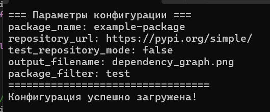
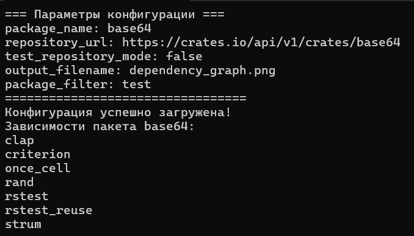

# DependencyGraph (26 ВАРИАНТ)
# Минимальный прототип с конфигурацией

## Цель этапа
Создание минимального CLI-приложения для визуализации графа зависимостей с настраиваемой конфигурацией через XML-файл.

## Архитектура решения

### Основной класс
**ConfigLoader** - класс предназначенный для загрузки конфигурации:
- Загрузка и парсинг XML-конфигурации
- Валидация параметров
- Обработка ошибок
- Вывод параметров в требуемом формате

## Реализованная функциональность

### Конфигурационные параметры

Все требуемые параметры поддерживаются:

|       Параметр       |   Тип   | Обязательный |               Описание               |
|----------------------|---------|--------------|--------------------------------------|
| package_name         | string  | Да           | Имя анализируемого пакета            |
| repository_url       | string  | Да           | URL репозитория или путь к файлу     |
| test_repository_mode | boolean | Да           | Режим работы с тестовым репозиторием |
| output_filename      | string  | Да           | Имя файла для изображения графа      |
| package_filter       | string  | Нет          | Подстрока для фильтрации пакетов     |

### Формат конфигурационного файла
```xml
<?xml version="1.0" encoding="UTF-8"?>
<config>
    <package_name>example-package</package_name>
    <repository_url>https://pypi.org/simple/</repository_url>
    <test_repository_mode>false</test_repository_mode>
    <output_filename>dependency_graph.png</output_filename>
    <package_filter>test</package_filter>
</config>
```
### Парсинг XML
- Используется библиотека TinyXML2 для:
- Загрузки XML-файла
- Извлечения значений тегов
- Проверки наличия обязательных полей
### Вывод параметров
При успешной загрузке выводится список всех параметров в формате ключ-значение:
bash
```
=== Параметры конфигурации ===
package_name: example-package
repository_url: https://pypi.org/simple/
test_repository_mode: false
output_filename: dependency_graph.png
package_filter: test
=================================
Конфигурация успешно загружена!
```
### Обработка ошибок
| Тип ошибки | Сообщение об ошибке | Причина |
|------------|---------------------|---------|
| Файл не найден | `ОШИБКА: Не удалось загрузить файл:` | Указанный файл конфигурации не существует |
| Отсутствует корневой элемент | `"ОШИБКА: Ошибка отстутсвует корневой элемент` | В XML файле отсутствует корневой тег `<config>` |
| Отсутствует обязательное поле | `ОШИБКА: Отсутствует обязательное поле package_name` | Обязательный параметр отсутствует или пустой |
## Примеры работы



*Рис. 1: Пример вывода конфигурации*

# Сбор данных

## Цель этапа
Реализовать основную логику получения данных о зависимостях для их дальнейшего анализа и визуализации без использования менеджеров пакетов и сторонних библиотек для получения информации о зависимостях пакетов.

## Архитектура решения

### Основные классы

**DependencyParser** - класс для получения и обработки данных о зависимостях:
- Выполнение HTTP-запросов к API crates.io
- Парсинг JSON-ответов
- Извлечение информации о зависимостях
- Обработка ошибок сетевых запросов и парсинга

**CurlParsingError** - класс исключений для ошибок CURL

**JsonParsingError** - класс исключений для ошибок парсинга JSON

## Реализованная функциональность

### Получение данных о зависимостях

- Получение JSON по URL
- Парсинг метаданных пакета
- Получение списка зависимостей
- Обработка HTTP-ответов

### Формат работы с API crates.io

1. **Запрос метаданных пакета (для извлечения версии)**: `https://crates.io/api/v1/crates/{package_name}`
2. **Запрос зависимостей**: `https://crates.io/api/v1/crates/{package_name}/{version}/dependencies`

### Вывод зависимостей

При успешном получении данных выводится список прямых зависимостей:
bach
```
Зависимости пакета base64:
clap
criterion
once_cell
rand
rstest
rstest_reuse
strum
```
### Обработка ошибок 
| Тип ошибки | Класс исключения | Сообщение об ошибке |
|------------|------------------|---------------------|
| Ошибка CURL | `CurlParsingError` | `Ошибка Curl: {детали ошибки}` |
| Ошибка парсинга JSON | `JsonParsingError` | `JSON ошибка разбора: {детали ошибки}` |
| Пакет не найден | `JsonParsingError` | `JSON ошибка разбора: пакет не найден` |
| Отсутствуют зависимости | - | `Зависимостей не найдено:(` |

## Примеры работы


*Рис. 2: Пример вывода списка зависимостей пакета base64*
