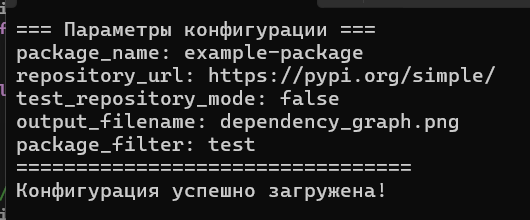
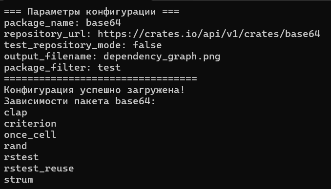
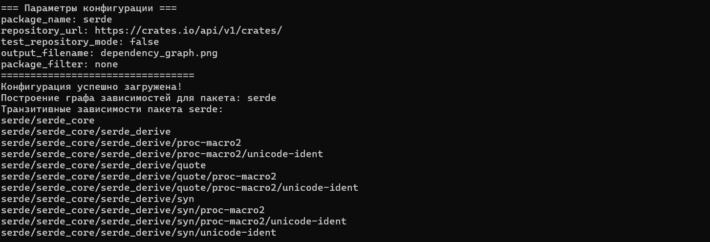

# DependencyGraph (26 ВАРИАНТ)
# Минимальный прототип с конфигурацией

## Цель этапа
Создание минимального CLI-приложения для визуализации графа зависимостей с настраиваемой конфигурацией через XML-файл.

## Архитектура решения

### Основной класс
**ConfigLoader** - класс предназначенный для загрузки конфигурации:
- Загрузка и парсинг XML-конфигурации
- Валидация параметров
- Обработка ошибок
- Вывод параметров в требуемом формате

## Реализованная функциональность

### Конфигурационные параметры

Все требуемые параметры поддерживаются:

|       Параметр       |   Тип   | Обязательный |               Описание               |
|----------------------|---------|--------------|--------------------------------------|
| package_name         | string  | Да           | Имя анализируемого пакета            |
| repository_url       | string  | Да           | URL репозитория или путь к файлу     |
| test_repository_mode | boolean | Да           | Режим работы с тестовым репозиторием |
| output_filename      | string  | Да           | Имя файла для изображения графа      |
| package_filter       | string  | Нет          | Подстрока для фильтрации пакетов     |

### Формат конфигурационного файла
```xml
<?xml version="1.0" encoding="UTF-8"?>
<config>
    <package_name>example-package</package_name>
    <repository_url>https://pypi.org/simple/</repository_url>
    <test_repository_mode>false</test_repository_mode>
    <output_filename>dependency_graph.png</output_filename>
    <package_filter>test</package_filter>
</config>
```
### Парсинг XML
- Используется библиотека TinyXML2 для:
- Загрузки XML-файла
- Извлечения значений тегов
- Проверки наличия обязательных полей
### Вывод параметров
При успешной загрузке выводится список всех параметров в формате ключ-значение:
bash
```
=== Параметры конфигурации ===
package_name: example-package
repository_url: https://pypi.org/simple/
test_repository_mode: false
output_filename: dependency_graph.png
package_filter: test
=================================
Конфигурация успешно загружена!
```
### Обработка ошибок
| Тип ошибки | Сообщение об ошибке | Причина |
|------------|---------------------|---------|
| Файл не найден | `ОШИБКА: Не удалось загрузить файл:` | Указанный файл конфигурации не существует |
| Отсутствует корневой элемент | `"ОШИБКА: Ошибка отстутсвует корневой элемент` | В XML файле отсутствует корневой тег `<config>` |
| Отсутствует обязательное поле | `ОШИБКА: Отсутствует обязательное поле package_name` | Обязательный параметр отсутствует или пустой |
## Примеры работы



*Рис. 1: Пример вывода конфигурации*

# Сбор данных

## Цель этапа
Реализовать основную логику получения данных о зависимостях для их дальнейшего анализа и визуализации без использования менеджеров пакетов и сторонних библиотек для получения информации о зависимостях пакетов.

## Архитектура решения

### Основные классы

**DependencyParser** - класс для получения и обработки данных о зависимостях:
- Выполнение HTTP-запросов к API crates.io
- Парсинг JSON-ответов
- Извлечение информации о зависимостях
- Обработка ошибок сетевых запросов и парсинга

**CurlParsingError** - класс исключений для ошибок CURL

**JsonParsingError** - класс исключений для ошибок парсинга JSON

## Реализованная функциональность

### Получение данных о зависимостях

- Получение JSON по URL
- Парсинг метаданных пакета
- Получение списка зависимостей
- Обработка HTTP-ответов

### Формат работы с API crates.io

1. **Запрос метаданных пакета (для извлечения версии)**: `https://crates.io/api/v1/crates/{package_name}`
2. **Запрос зависимостей**: `https://crates.io/api/v1/crates/{package_name}/{version}/dependencies`

### Вывод зависимостей

При успешном получении данных выводится список прямых зависимостей:
bach
```
Зависимости пакета base64:
clap
criterion
once_cell
rand
rstest
rstest_reuse
strum
```
### Обработка ошибок 
| Тип ошибки | Класс исключения | Сообщение об ошибке |
|------------|------------------|---------------------|
| Ошибка CURL | `CurlParsingError` | `Ошибка Curl: {детали ошибки}` |
| Ошибка парсинга JSON | `JsonParsingError` | `JSON ошибка разбора: {детали ошибки}` |
| Пакет не найден | `JsonParsingError` | `JSON ошибка разбора: пакет не найден` |
| Отсутствуют зависимости | - | `Зависимостей не найдено:(` |

## Примеры работы


*Рис. 2: Пример вывода списка зависимостей пакета base64*


# Основные операции


## Выполненные работы

### 1. Реализация DFS с рекурсией

**Задача:** Заменить алгоритм BFS на DFS с рекурсивным обходом графа зависимостей.

**Реализация:**
- Создан метод `getTransitiveDependenciesDFS()` в классе `DependencyParser`
- Алгоритм использует рекурсивный обход в глубину
- Добавлен параметр `depth` для контроля глубины рекурсии

```cpp
void DependencyParser::getTransitiveDependenciesDFS(const string& packageName, 
                                                  vector<string>& result, 
                                                  unordered_set<string>& visited, 
                                                  string currentPath,
                                                  const vector<string>& filters,
                                                  int depth)
```

### 2. Обработка циклических зависимостей

**Механизм обнаружения:**
- Используется множество `visited` для отслеживания посещенных пакетов
- При обнаружении цикла выводится предупреждающее сообщение
- Рекурсия прерывается для данного пути

```cpp
if (visited.find(packageName) != visited.end()) {
    cout << "Обнаружена циклическая зависимость: " << packageName << " в пути " << currentPath << endl;
    return;
}
```

### 3. Защита от бесконечной рекурсии

**Реализация:**
- Установлено ограничение максимальной глубины рекурсии (`MAX_DEPTH = 10`)
- При превышении лимита выводится предупреждение

```cpp
const int MAX_DEPTH = 10;
if (depth > MAX_DEPTH) {
    cout << "WARNING: Превышена максимальная глубина рекурсии (" << MAX_DEPTH << ")" << endl;
    return;
}
```

### 4. Фильтрация пакетов

**Реализация:**
- Фильтрация выполняется на основе подстроки, заданной пользователем
- Пакеты, содержащие фильтруемую подстроку, исключаются из анализа

```cpp
bool filtered = false;
for (const string& filter : filters) {
    if (dep.find(filter) != string::npos) {
        filtered = true;
        break;
    }
}
if (filtered) continue;
```

### 5. Режим тестового репозитория

**Особенности реализации:**
- Эмуляция простого графа зависимостей с пакетами A, B, C, D, E
- Структура графа: A→B→C→E, A→C, B→D
- В тестовом режиме URL пакета совпадает с его именем

```cpp
if (m_testRepositoryMode) {
    if (packageUrl.find("A") != string::npos) return R"({"dependencies": ["B", "C"]})";
    if (packageUrl.find("B") != string::npos) return R"({"dependencies": ["C", "D"]})";
    // ... и т.д.
}
```

### 6. Рефакторинг класса DependencyParser

**Изменения в конструкторе:**
```cpp
// Было:
DependencyParser(string repositoryUrl);

// Стало:
DependencyParser(string repositoryUrl, bool testRepositoryMode);
```

**Удаленные параметры:**
- Параметр `packageName` удален из конструктора
- Теперь `packageName` передается в методы как аргумент

## Архитектурные изменения

### Класс DependencyParser
- **Поля:** `m_repositoryUrl`, `m_testRepositoryMode`, `m_dependencyCache`
- **Методы:** 
  - `getPackageDependencies()` - получение прямых зависимостей
  - `getPackageDependenciesTransitive()` - получение транзитивных зависимостей
  - `getTransitiveDependenciesDFS()` - рекурсивный DFS обход

### Взаимодействие компонентов
```
DependencyGraph.cpp → ConfigLoader → DependencyParser
       ↓                ↓                ↓
   main()          Загрузка config   Анализ зависимостей
```

## Тестирование

### Сценарий 1: Нормальная работа
**Входные данные:**
- Пакет: "A"
- Фильтр: отсутствует

**Результат:**
```
A/B
A/B/C
A/B/C/E
A/B/D
A/C
A/C/E
```

### Сценарий 2: Фильтрация пакетов
**Входные данные:**
- Пакет: "A" 
- Фильтр: "C"

**Результат:**
```
A/B
A/B/D
```

### Сценарий 3: Обнаружение циклов
**Тестовый граф:** A→B→A (цикл)

**Результат:**
```
Обнаружена циклическая зависимость: A в пути A/B/A
```

## Обработка ошибок

1. **Циклические зависимости** - обнаружение и корректное завершение обхода
2. **Превышение глубины рекурсии** - защита от переполнения стека
3. **Ошибки парсинга JSON** - перехват исключений и вывод сообщений
4. **Ошибки сетевых запросов** - обработка ошибок CURL

## Соответствие требованиям этапа

- ✅ Реализован DFS с рекурсией
- ✅ Фильтрация пакетов по подстроке
- ✅ Обработка циклических зависимостей  
- ✅ Режим тестового репозитория
- ✅ Все параметры (кроме фильтра) передаются в DependencyParser
- ✅ Сохранение результатов в репозиторий

## Примеры работы

Пример xml-файла:
```xml
<?xml version="1.0" encoding="utf-8"?>
<config>
  <package_name>serde</package_name>
  <repository_url>https://crates.io/api/v1/crates/</repository_url>
  <test_repository_mode>false</test_repository_mode>
  <output_filename>dependency_graph.png</output_filename>
  <package_filter></package_filter>
</config>
```


*Рис. 3: Пример вывода списка транзитивных зависимостей пакета serde*